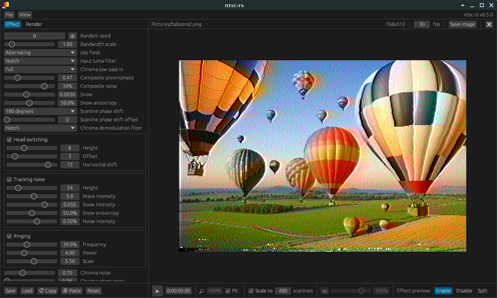

<p align="center">
    <picture>
        <source media="(prefers-color-scheme: dark)" srcset="./docs/img/logo-darkmode.svg">
        
    </picture>
</p>

---

**pal-rs** is a video effect which emulates PAL and VHS video artifacts. Based on NTSC-RS, It can be used as an After Effects, Premiere, or OpenFX plugin, or as a standalone application.



## Download

The latest version of pal-rs can be downloaded from [the releases page]([https://github.com/valadaptive/ntsc-rs/](https://github.com/LucianoTheWindowsFan/pal-rs/)releases).

### Windows

The GUI, and possibly the plugins as well, require [the Microsoft Visual C++ Redistributable](https://learn.microsoft.com/en-US/cpp/windows/latest-supported-vc-redist?view=msvc-170#visual-studio-2015-2017-2019-and-2022). Since a lot of other software does too, you probably already have it installed, but if you get an error about VCRUNTIME140.dll being missing, you need to install it.

### Linux

If you're using Linux, the GUI in particular requires GStreamer and some of its plugins to be installed:

<details>
<summary>Ubuntu / Debian</summary>

```bash
$ sudo apt-get install libgstreamer1.0 gstreamer1.0-plugins-base gstreamer1.0-plugins-good gstreamer1.0-plugins-bad gstreamer1.0-plugins-ugly gstreamer1.0-libav gstreamer1.0-alsa
```
</details>

<details>
<summary>Fedora</summary>

In order to decode and encode H.264 video, you'll need packages from the [RPM Fusion "free" repository](https://rpmfusion.org/Configuration).

After enabling the RPM Fusion "free" repository:

```bash
$ sudo dnf install gstreamer1 gstreamer1-plugins-base gstreamer1-plugins-good gstreamer1-plugins-bad-free gstreamer1-plugins-bad-freeworld gstreamer1-plugins-ugly gstreamer1-plugin-libav libavcodec-freeworld
```
</details>

On Linux, you'll probably also need to give it execute permissions. This can be found under "Properties > Executable as Program" in the GNOME file manager, and similar places on others. You can also use the terminal (`chmod +x ntsc-rs-standalone`).

## More information

pal-rs is a fork of [ntsc-rs](https://github.com/valadaptive/ntsc-rs), rough Rust port of [ntscqt](https://github.com/JargeZ/ntscqt), itself a PyQt-based GUI for [ntsc](https://github.com/zhuker/ntsc), also in itself a Python port of [composite-video-simulator](https://github.com/joncampbell123/composite-video-simulator). Reimplementing the image processing in multithreaded Rust allows it to run at (mostly) real-time speeds.

It's not an exact port--some processing passes have visibly different results, and some new ones have been added.
